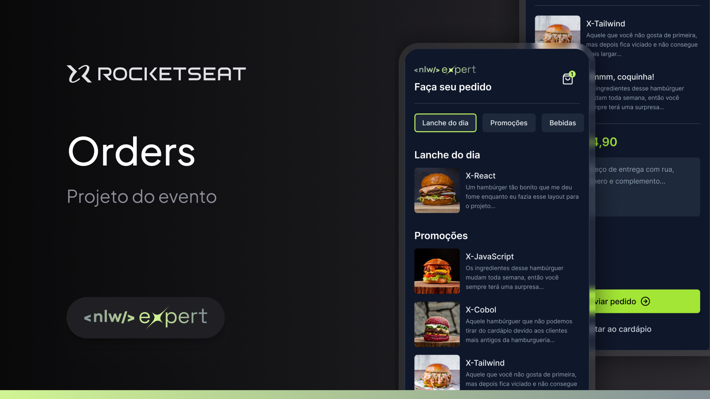

<h1 align="center">
  
</h1>

  <a href="#-tecnologias">Tecnologias</a>&nbsp;&nbsp;&nbsp;|&nbsp;&nbsp;&nbsp;
  <a href="#-projeto">Projeto</a>&nbsp;&nbsp;&nbsp;|&nbsp;&nbsp;&nbsp;
  <a href="#-sobre">Sobre</a>&nbsp;&nbsp;&nbsp;|&nbsp;&nbsp;&nbsp;

 

  

## 🚀 Tecnologias

Esse projeto foi desenvolvido com as seguintes tecnologias:

- [React Native](https://reactnative.dev/)
- [Expo](https://expo.io/)
- [Nativewind](https://www.nativewind.dev/)
- [Tailwindcss](https://tailwindcss.com/)
- [TypeScript](https://www.typescriptlang.org/)

## 💻 Projeto

Orders é uma aplicação feita para gerenciar pedidos de forma simples.  O usuário poderá escolher o pedido conforme as categorias disponiveis e enviar via Whatsapp seu pedido para o estabelecimento.

Layout do projeto desenvolvido na Trilha Ignite do NLW Spacetime.

- [Layout](https://www.figma.com/community/file/1336456468568916765/nlw-expert-orders)

## 📜 Sobre

Este é um projeto desenvolvido durante a **[Next Level Week](https://nextlevelweek.com/)**, apresentado por **[@Rocketseat](https://github.com/Rocketseat)** de 05 a 08 de fevereiro de 2024.  

